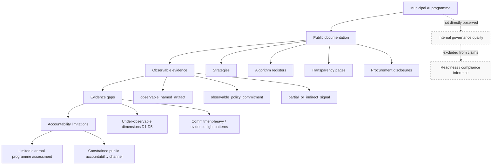

# Conceptual model v0.1

**Aligned with:** [`research_design_v0_1.md`](research_design_v0_1.md) · [`study_protocol_v0_1.md`](study_protocol_v0_1.md)

This document presents the study's conceptual model linking municipal AI programmes to accountability limitations through public documentation and evidence gaps.

---

## 1. Model statement (text)

Municipalities operate **municipal AI programmes**—collections of systems, vendors, workflows, and governance arrangements that may include strategies, registers, oversight routines, and lifecycle controls. Not all programme characteristics are disclosed publicly.

Municipalities produce **public documentation** to signal commitment, comply with transparency expectations, and inform citizens and oversight bodies. Public documentation is selective: it foregrounds some governance elements and omits or generalises others.

From public documentation, external reviewers can extract **observable evidence** when governance information is named, locatable, and specific enough to support independent assessment. Observable evidence ranges from concrete artefacts (named roles, register fields, contract references) to policy commitments and partial signals.

Where programme-level evidence is missing, thin, or only indirectly signalled, **evidence gaps** emerge. Gaps are analytic findings about the public record—not proof of internal absence, poor practice, or legal non-compliance.

Evidence gaps create **accountability limitations** for external actors. Without observable ownership, oversight routines, log governance, vendor stewardship, or lifecycle artefacts, councils, auditors, researchers, and citizens cannot fully exercise accountability through public documentation alone. Internal accountability may continue; **public accountability via the documentary channel is constrained**.

The study measures Public-Document Observability and evidence gaps; it does not traverse the dashed boundary into inference of internal governance quality or readiness scoring.

---

## 2. Constructs

| Construct | Definition | Measured? |
|-----------|------------|-----------|
| Municipal AI programme | Local government AI systems, governance arrangements, and vendor dependencies | No (context only) |
| Public documentation | Official publicly accessible AI governance materials | Yes (corpus manifest) |
| Observable evidence | Locatable governance information in public documents | Yes (D1–D5 coding) |
| Evidence gaps | Dimensions where evidence is partial or not publicly observable | Yes (pattern analysis) |
| Accountability limitations | Constraints on external oversight via public record | Discussed (derived) |
| Internal governance quality | Organisational practice behind the public record | **Explicitly excluded** |

---

## 3. Propositions (to be tested empirically)

**P1.** Public documentation will more frequently contain observable **principles and commitments** than observable **programme-level artefacts** (ownership, oversight, logs, vendor stewardship, lifecycle accountability).

**P2.** Evidence gaps will cluster in dimensions D3 (prompt/log/data governance), D4 (procurement/vendor stewardship), and D5 (incident/audit/lifecycle) relative to D1 (programme ownership).

**P3.** Document types will exhibit different observability profiles—strategies emphasising commitments, registers emphasising system inventory, transparency pages varying in operational detail.

**P4.** Cross-municipal comparison will reveal **patterns** of transparency and gap co-occurrence without supporting ordinal ranking.

These propositions guide analysis; they are not findings.

---

## 4. Conceptual model diagram (Mermaid)



---

## 5. Simplified causal chain (ASCII)

```
Municipal AI programme
        │
        ▼
Public documentation ──────────────────────────────┐
        │                                          │
        ▼                                          │ (not observed)
Observable evidence                              Internal governance
        │                                          (out of scope)
        ▼
Evidence gaps
        │
        ▼
Accountability limitations
(for external reviewers via public record)
```

---

## 6. Link to coding dimensions

| Model stage | Coding operationalisation |
|-------------|---------------------------|
| Public documentation | `corpus_manifest_template.csv` |
| Observable evidence | D1–D5 × evidence-status labels |
| Evidence gaps | Prevalence of `partial_or_indirect_signal` and `not_observable_publicly` |
| Accountability limitations | Interpretive synthesis in discussion; not a scored variable |

---

## Document history

| Version | Date | Change |
|---------|------|--------|
| 0.1 | 2026-06-08 | Initial conceptual model with text and Mermaid diagram |
